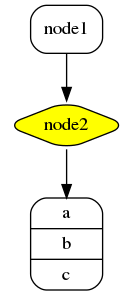
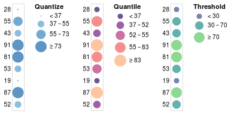
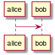

# 🖍 Asciidoctor Kroki Extension

[](https://github.com/Mogztter/asciidoctor-kroki/actions?query=workflow%3ABuild+branch%3Amaster)
[](https://www.npmjs.com/package/asciidoctor-kroki)
[](https://gitter.im/kroki-project/community)

An extension for [Asciidoctor.js](https://github.com/asciidoctor/asciidoctor.js) to convert diagrams to images using [Kroki](https://kroki.io)!

  * [Install](#install)
    + [Node.js](#nodejs)
    + [Browser](#browser)
  * [Usage](#usage)
  * [Configuration](#configuration)
  * [Using Your Own Kroki](#using-your-own-kroki)
  * [Antora Integration](#antora-integration)
  * [Contributing](#contributing)
    + [Setup](#setup)
    + [Building](#building)

## Install

### Node.js

Install the dependencies:

    $ npm install asciidoctor asciidoctor-kroki

Create a file named `kroki.js` with following content and run it:

```javascript
const asciidoctor = require('@asciidoctor/core')()
const kroki = require('asciidoctor-kroki')

const input = 'plantuml::hello.puml[svg,role=sequence]'

kroki.register(asciidoctor.Extensions) // <1>
console.log(asciidoctor.convert(input))

const registry = asciidoctor.Extensions.create()
kroki.register(registry) // <2>
console.log(asciidoctor.convert(input, {'extension_registry': registry}))
```
**<1>** Register the extension in the global registry <br/>
**<2>** Register the extension in a dedicated registry

### Browser

Install the dependencies:

    $ npm install asciidoctor asciidoctor-kroki

Create a file named `kroki.html` with the following content and open it in your browser:

```html
<html>
  <head>
    <script src="node_modules/@asciidoctor/core/dist/browser/asciidoctor.js"></script>
    <script src="node_modules/asciidoctor-kroki/dist/browser/asciidoctor-kroki.js"></script>
  </head>
  <body>
    <div id="content"></div>
    <script>
      var input = 'plantuml::hello.puml[svg,role=sequence]'

      var asciidoctor = Asciidoctor()
      var kroki = AsciidoctorKroki

      const registry = asciidoctor.Extensions.create()
      kroki.register(registry) // <1>
      var result = asciidoctor.convert(input, {'extension_registry': registry})
      document.getElementById('content').innerHTML = result
    </script>
  </body>
</html>
```
**<1>** Register the extension in a dedicated registry

## Usage

Kroki currently supports the following diagram libraries:

* ActDiag: `actdiag`
* BlockDiag: `blockdiag`
* BPMN: `bpmn`
* Bytefield: `bytefield`
* C4 (PlantUML): `c4plantuml`
* Ditaa: `ditaa`
* ERD: `erd`
* GraphViz : `graphviz`
* Mermaid: `mermaid`
* Nomnoml: `nomnoml`
* NwDiag: `nwdiag`
* PacketDiag: `packetdiag`
* PlantUML: `plantuml`
* RackDiag: `rackdiag`
* SeqDiag: `seqdiag`
* SVGBob: `svgbob`
* UMLet: `umlet`
* Vega: `vega`
* Vega-Lite: `vegalite`
* WaveDrom: `wavedrom`

In your AsciiDoc document, you can either declare your diagram inline or reference a diagram file using the corresponding macro or using the `include` directive. 

Here's an example where we declare a GraphViz diagram directly in our AsciiDoc document using the block syntax:

```adoc
[graphviz]
....
digraph foo {
  node [style=rounded]
  node1 [shape=box]
  node2 [fillcolor=yellow, style="rounded,filled", shape=diamond]
  node3 [shape=record, label="{ a | b | c }"]

  node1 -> node2 -> node3
}
....
```



In the example below, we are using the `vegalite` macro to reference a file named *chart.vlite*:

```
vegalite::chart.vlite[svg,role=chart,opts=interactive]
```




Finally, we can use the `include` directive to reference a diagram file:

```
[plantuml,alice-bob,svg,role=sequence]
....
include::alice-bob.puml[]
....
```



## Configuration

| Attribute name | Description | Default value  |
| ---- | ---- | ---- |
| `kroki-server-url` | The URL of the Kroki server (see "Using Your Own Kroki") | `https://kroki.io`
| `kroki-fetch-diagram` | Define if we should download (and save on the disk) the images from the Kroki server.<br/>This feature is not available when running in the browser. | `false`
| `kroki-http-method` | Define how we should get the image from the Kroki server. Possible values:<br/><ul><li>`get`: always use GET requests</li><li>`post`: always use POST requests</li><li>`adaptive`: use a POST request if the URI length is longer than 4096 characters, otherwise use a GET request</li></ul> | `adaptive` |

## Using Your Own Kroki

By default, this extension sends information and receives diagrams back from https://kroki.io.

You may choose to use your own server due to:

* Network restrictions - if Kroki is not available behind your corporate firewall
* Network latency - you are far from the European public instance
* Privacy - you don't want to send your diagrams to a remote server on the internet

This is done using the `kroki-server-url` attribute.
Typically, this is at the top of the document (under the title):

```adoc
:kroki-server-url: http://my-server-url:port
```

For instance, if you have followed [the instructions](https://docs.kroki.io/kroki/setup/install/#_using_docker) to set up a self-managed server using Docker you can use the following:

```adoc
:kroki-server-url: http://localhost:8080
```

Note that either the `http://` or `https://` prefix _is_ required (the default Docker image only uses `http`).

You can also set this attribute using the Javascript API, for instance:

```js
asciidoctor.convertFile('file.adoc', { attributes: { 'kroki-server-url': 'http://my-server-url:port' } })
```

## Antora Integration

If you are using [Antora](https://antora.org/), you can integrate Kroki in your documentation site.

1. Install the extension in your playbook project:

       $ npm i asciidoctor-kroki

2. Register the extension in your playbook file:

    ```yaml
    asciidoc:
      extensions:
        - asciidoctor-kroki
    ```

    https://docs.antora.org/antora/2.2/playbook/configure-asciidoc/#extensions

3. Enjoy!

**💡 TIP**:
You can use the `kroki-fetch-diagram` option to download the images from Kroki at build time.
In other words, while viewing pages you won't rely on Kroki anymore.

```yaml
asciidoc:
  attributes:
    kroki-fetch-diagram: true
```

## Contributing

### Setup

To build this project, you will need Node.js >= 8.11 and npm (we recommend `nvm` to manage multiple active Node.js versions).

### Building

1. Install the dependencies:

       $ npm i

2. Generate a distribution:

       $ npm run dist

When working on a new feature or when fixing a bug, make sure to run the linter and the tests suite:

    $ npm run lint
    $ npm run test
